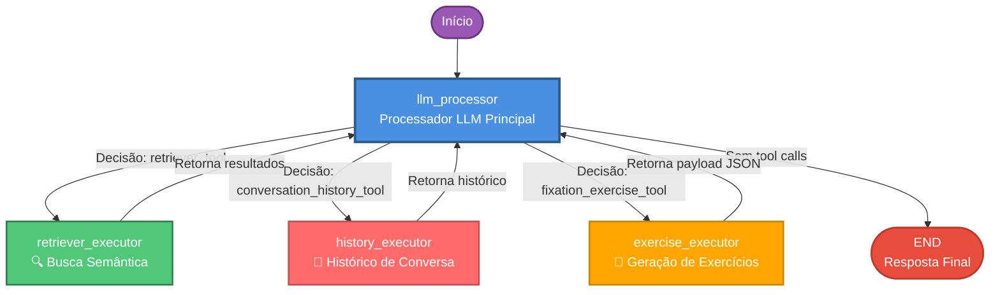
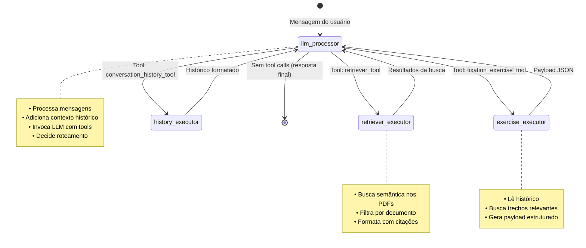
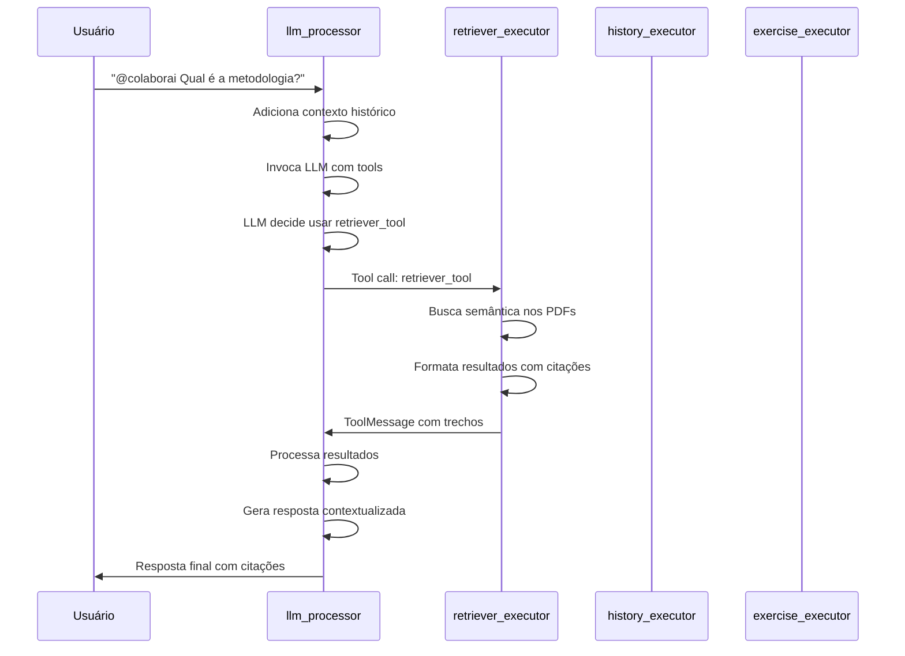
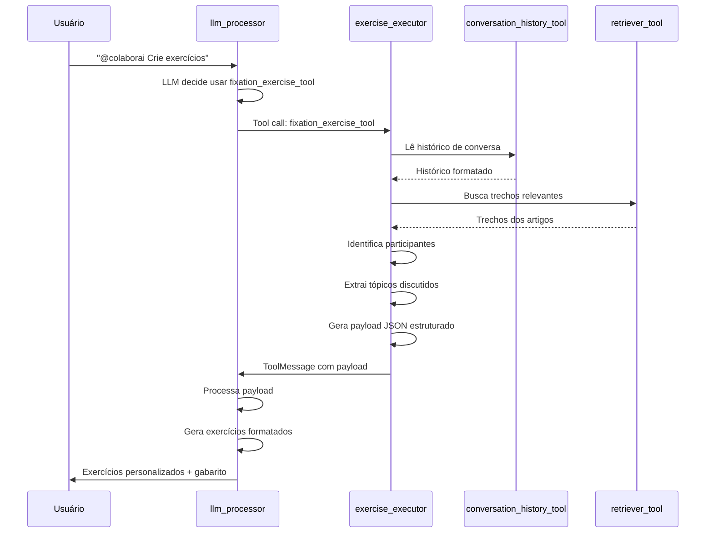
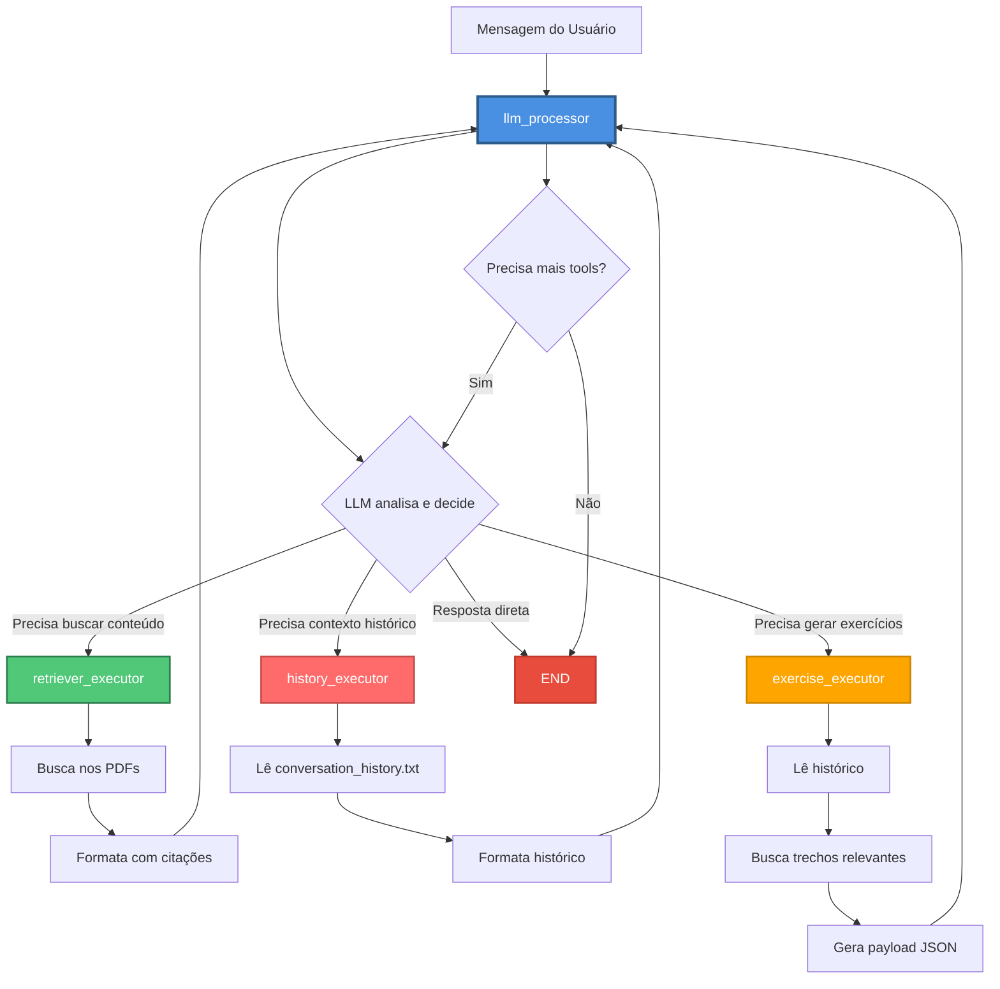
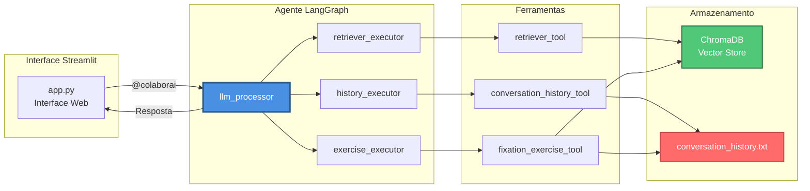

# Sistema de Discussão Acadêmica

Sistema de chat colaborativo para discussão de artigos científicos com assistente inteligente baseado em RAG (Retrieval Augmented Generation). Este projeto foi desenvolvido para a disciplina SSC0723 - Sistemas Colaborativos: Fundamentos e Aplicações (2025). 

## Funcionalidades

### 1. **Chat Colaborativo Multi-Usuário**
- 5 participantes pré-configurados: Artur, Pedro, João, Rebeca e Lucas
- Mensagens atribuídas a cada participante
- Histórico persistente compartilhado entre todos

### 2. **Sistema RAG (Retrieval Augmented Generation)**
- Upload de múltiplos PDFs (1-5 artigos científicos)
- Indexação automática com embeddings locais
- Busca semântica inteligente no conteúdo dos artigos

### 3. **Assistente IA com 3 Ferramentas Especializadas**

#### **retriever_tool**
- Busca semântica no conteúdo dos artigos
- Suporte a filtros por documento específico
- Retorna trechos relevantes com citações

#### **conversation_history_tool**
- Acessa histórico recente da conversa
- Entende contexto das discussões
- Identifica participantes ativos

#### **fixation_exercise_tool**
- Gera exercícios de fixação personalizados
- Baseado no conteúdo dos artigos E na discussão do grupo
- Cria 2-3 questões por participante
- Inclui gabarito completo com explicações
- Varia tipos de questões: compreensão, análise, aplicação, síntese

### 4. **Invocação do Assistente**
- Use `@colaborai` em qualquer mensagem para chamar o assistente
- Processamento automático com acesso às ferramentas
- Respostas contextualizadas e citadas

## Como Usar

### Pré-requisitos

- Python 3.11 ou superior
- Chave de API do OpenRouter

### Instalação

1. Clone o repositório:
```bash
git clone <url-do-repositorio>
cd rag-chat-colab
```

2. Instale as dependências:
```bash
pip install -r requirements.txt
```

3. Configure a chave da API:

Crie um arquivo `.env` na raiz do projeto:
```env
OPENROUTER_API_KEY=sua_chave_aqui
```

Obtenha sua chave gratuita em: https://openrouter.ai/keys

### Executando a Aplicação

```bash
streamlit run app.py
```

A aplicação será aberta automaticamente no navegador em `http://localhost:8501`

## Guia de Uso

### 1. Upload de Artigos

1. Na barra lateral, clique em "Enviar PDF(s)"
2. Selecione 1 a 5 artigos científicos em PDF
3. Clique em "Construir/Atualizar índice"
4. Aguarde a indexação (pode levar alguns minutos)

### 2. Iniciar o Agente

1. Na barra lateral, clique em "Criar/Recriar agente"
2. O assistente estará pronto para uso

### 3. Participar da Discussão

1. Selecione seu nome no dropdown "Quem está falando agora?"
2. Digite sua mensagem no chat
3. Para chamar o assistente, inclua `@colaborai` na mensagem

## Arquitetura

# Diagrama Mermaid do Grafo LangGraph

## 📊 Grafo Interativo (Mermaid)



## 🔄 Fluxo Detalhado com Estados



## 📋 Sequência de Execução



## 🎯 Caso de Uso: Geração de Exercícios



## 🔀 Diagrama de Decisão



## 📊 Arquitetura do Sistema



## 🎨 Legenda

- 🔵 **Azul**: Nó principal (llm_processor)
- 🟢 **Verde**: Executor de busca (retriever)
- 🔴 **Vermelho**: Executor de histórico (history)
- 🟠 **Laranja**: Executor de exercícios (exercise)
- 🟣 **Roxo**: Ponto de entrada
- ⚫ **Preto**: Ponto de saída (END)

---

**Nota**: Estes diagramas Mermaid podem ser renderizados em:
- GitHub/GitLab (Markdown)
- VS Code (com extensão Mermaid)
- Obsidian
- Notion
- Muitos outros editores Markdown modernos


## Cenário de Uso

Grupo de estudantes prepara-se para uma avaliação:
1. Fazem upload dos artigos obrigatórios da disciplina
2. Discutem conceitos principais no chat
3. Tiram dúvidas com o assistente `@colaborai`
4. Geram exercícios de fixação automaticamente
5. Praticam com as questões personalizadas

inserir vídeo
