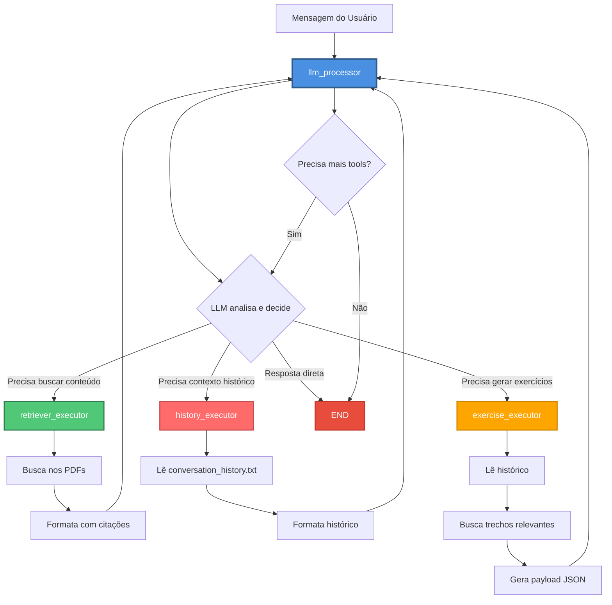
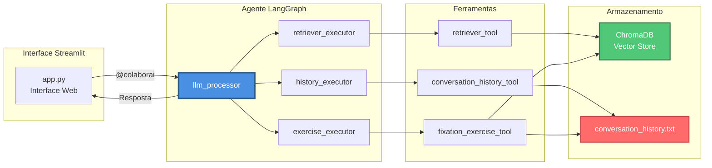

# Sistema de Discussão Acadêmica

Trabalho desenvolvido para a disciplina: SSC0723 - Sistemas Colaborativos: Fundamentos e Aplicações (2025)

Alunos:
Artur De Vlieger Lima - 13671574
João Pedro Mori Machado - 13671831
Lucas Issao Omati - 13673090
Pedro Augusto Monteiro Delgado - 13672766
Rebeca Vieira Carvalho - 12543530

## Descrição do Cenário Escolhido

Para o desenvolvimento da nossa aplicação, o cenário imaginado foi criar um Sistema de Discussão para auxiliar grupos de estudo focados em um tópico específico. Nosso sistema tem a premissa de ser um ambiente de chat no qual os membros podem conversar e compartilhar documentos sobre o assunto escolhido. Nesse contexto, atua o *colaborai*, um agente LLM com RAG que acompanha ativamente a conversa do grupo, auxiliando os membros na discussão e no aprendizado do tópico. A seguir, detalharemos as ferramentas e funcionalidades que ele oferece.

### Funcionalidades

### 1. **Chat Colaborativo Multi-Usuário**
5 participantes pré-configurados: Artur, Pedro, João, Rebeca e Lucas. Mensagens atribuídas a cada participante e histórico persistente compartilhado entre todos

### 2. **Sistema RAG (Retrieval Augmented Generation)**
Upload de múltiplos PDFs (1 a 5), com indexação automática com embeddings locais e busca semântica no conteúdo dos artigos

### 3. **Assistente IA com 3 Ferramentas Especializadas**

**retriever_tool**: Realiza busca semântica no conteúdo dos artigos e retorna trechos relevantes com citações

**conversation_history_tool**: Acessa histórico recente da conversa e possibilita entendimento do contexto das discussões

**fixation_exercise_tool**: Gera exercícios de fixação para cada participante, baseados no conteúdo dos artigos e na discussão do grupo

### 4. **Invocação do Assistente**
Use `@colaborai` em qualquer mensagem para chamar o assistente, que realiza o processamento automático com acesso às ferramentas

## Diagramas

### Grafo de funcionalidades


### Diagrama de decisão



### Arquitetura do Sistema



## 3Cs

Confira a análise dos 3C (Comunicação, Colaboração e Coordenação) [aqui](cenario_colaborativo_3c.md).

## Como Usar

### Pré-requisitos

- Python 3.11 ou superior
- Chave de API do OpenRouter

### Instalação

1. Clone o repositório:
```bash
git clone <url-do-repositorio>
cd rag-chat-colab
```

2. Instale as dependências:
```bash
pip install -r requirements.txt
```

3. Configure a chave da API:

Crie um arquivo `.env` na raiz do projeto:
```env
OPENROUTER_API_KEY=sua_chave_aqui
```

Obtenha sua chave gratuita em: https://openrouter.ai/keys

### Executando a Aplicação

```bash
streamlit run app.py
```

A aplicação será aberta automaticamente no navegador em `http://localhost:8501`


